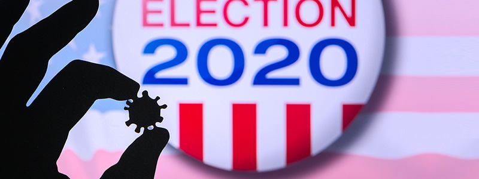

 

 
 
# Project motivation

The COVID-19 pandemic, the economy, and racial injustice have been top concerns in the 2020 presidential election. According to AP VoteCast, a national survey of the electorate, about 4 in 10 voters suggest the pandemic as the top issue while the economy follows behind. 

However, an Associated Press analysis gave conclusions with a surprising twist: in counties with worst COVID-19 surges, Trump enjoyed enormous support. We are interested in using polling data and data of the COVID-19 case incidence / death rates to investigate whether and how COVID-19 pandemic has influenced supporting rate distribution among all states, particularly in top battlegrounds.
 
 
  
 
 
# Project Overview

In this project, we focused on top battleground states (Florida, Pennsylvania, Wisconsin, North Carolina, Michigan, Ohio, Minnesota, Iowa, Arizona, Nevada, Texas, Georgia, Virginia, New Hampshire, Maine,Colorado and New Mexico)

We used [2020 presidential poll](https://www.realclearpolitics.com/), [mail-in vote data](https://electproject.github.io/) and [COVID-19 data](http://covidtracking.com/data/) to examine the relationship between COVID-19 and poll data.

We have provided insights on the following topics:

* Time trend of COVID-19 statistics and presidential poll in 2020

* Regression analysis of COVID-19 case / death rate and presidential poll in 2020

* Comparison of democrats / republican supporting rate between 2020 and 2016

* Supporting rate distribution among mail-in vote

